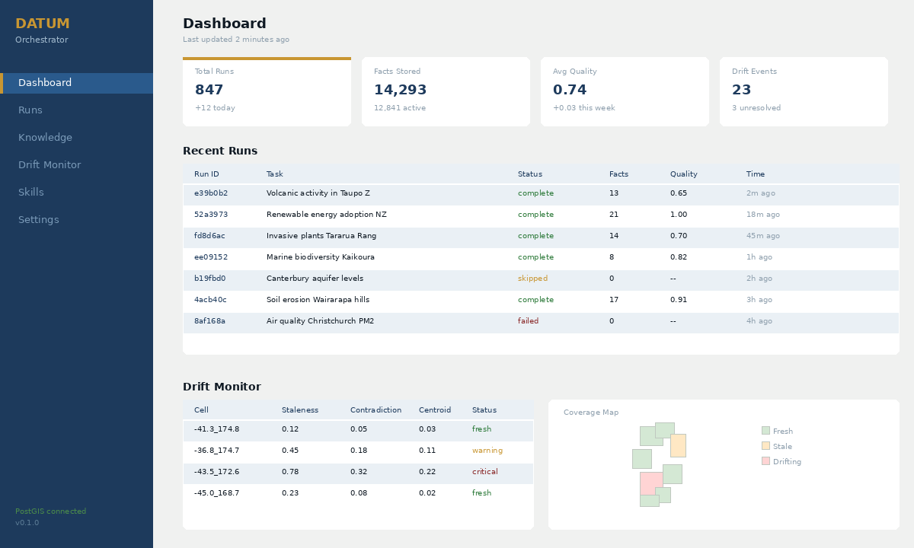
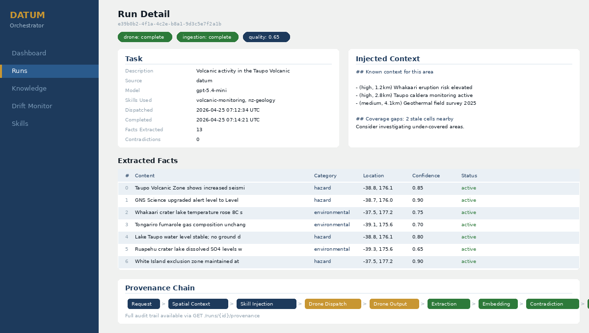
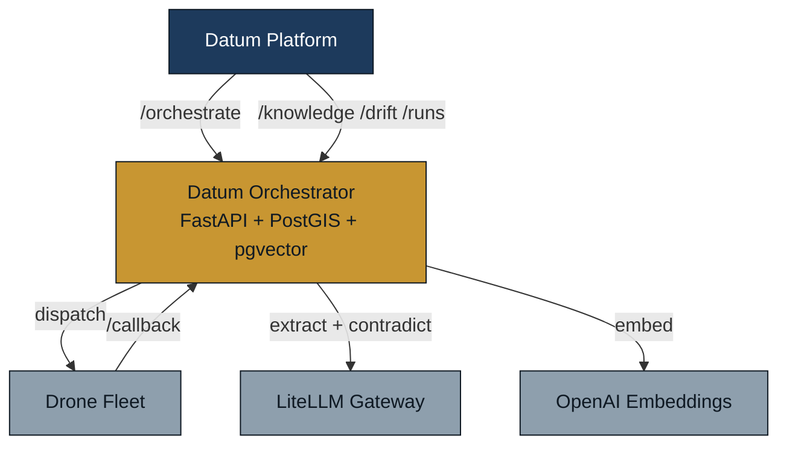
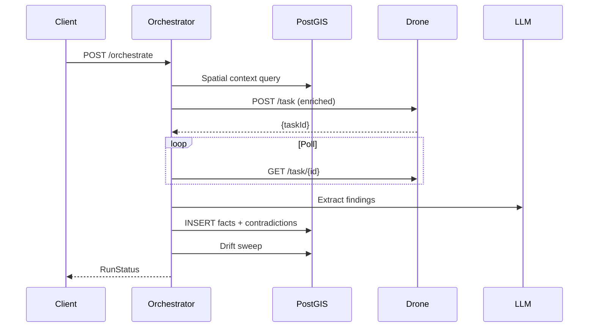
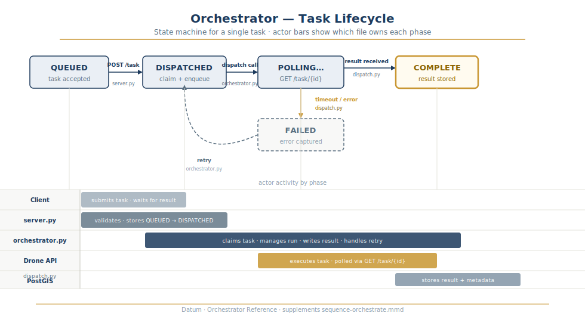
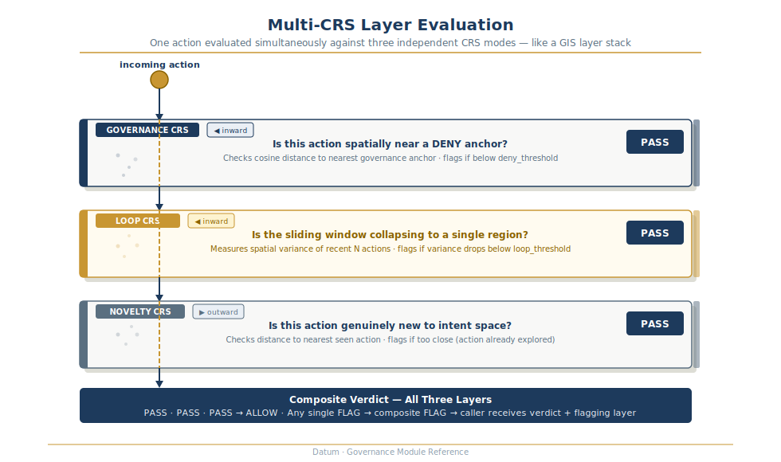
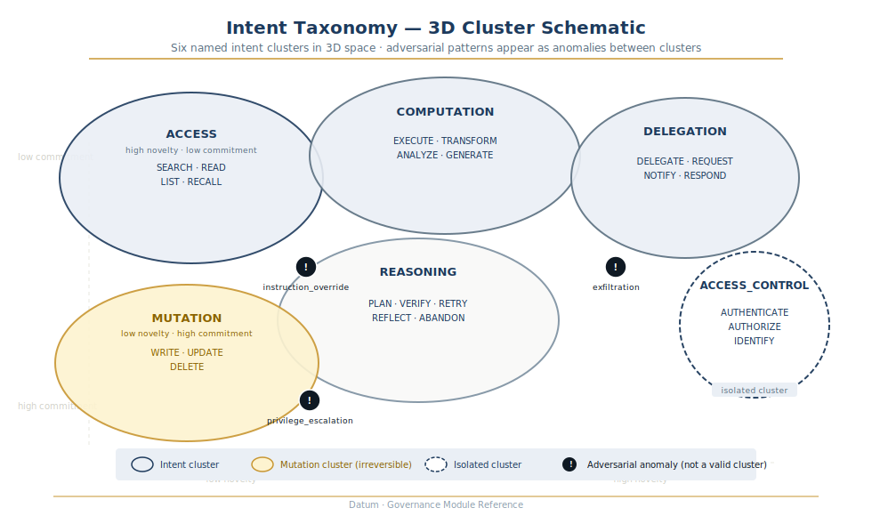
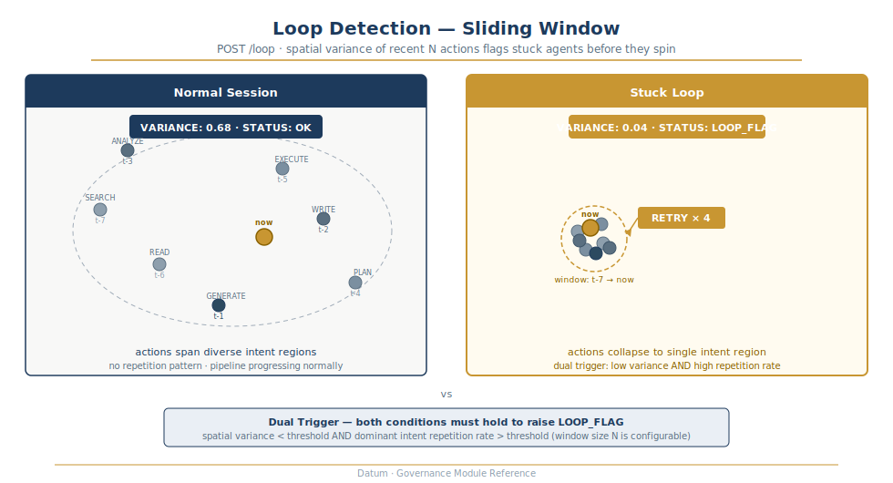
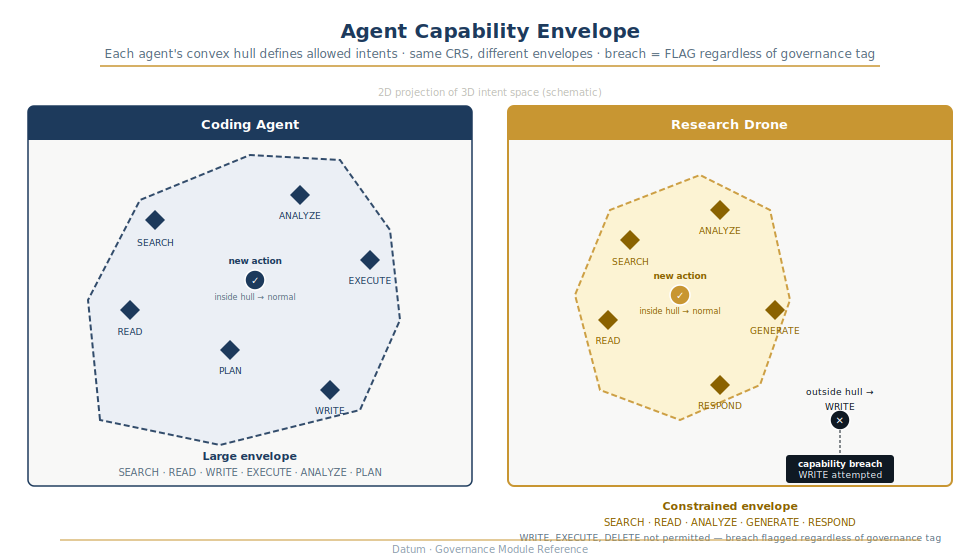

# Datum Orchestrator

Spatial self-learning orchestrator for the Datum drone fleet. Accepts research tasks, enriches them with prior spatial knowledge from PostGIS, dispatches to drones, ingests structured findings back into the knowledge store, and monitors for knowledge drift.

The orchestrator does not execute tasks itself. It enriches and dispatches.



## How it works

1. **Task arrives** from Datum (or direct API call) with a description, instructions, and optional coordinates
2. **Spatial context** is queried from PostGIS: nearby facts, recent contradictions, coverage gaps
3. **Skills** (SKILL.md files) are keyword-matched and injected into the drone prompt
4. **Drone dispatched** with enriched context via the drone fleet API
5. **Output ingested**: GPT-5.4 extracts structured findings, each embedded and stored with full provenance
6. **Contradiction detection** compares new findings against existing facts in the same area
7. **Drift sweep** checks staleness, contradiction rate, and embedding centroid drift per coverage cell
8. **Scoring** evaluates outcome quality and tracks skill effectiveness over time

Every data point traces back to its source drone output via full provenance chains. Facts are invalidated, never deleted.



## Architecture



### Modules

| Module | Purpose |
|---|---|
| `server.py` | FastAPI endpoints, lifecycle, background task wrappers |
| `orchestrator.py` | Core pipeline: enrich, dispatch, ingest, score |
| `ingest.py` | Extract findings (LLM), embed (OpenAI), store, detect contradictions |
| `drift.py` | Three drift signals: staleness, contradiction rate, centroid drift |
| `spatial.py` | PostGIS context: nearby facts, contradictions, coverage gaps |
| `skills.py` | SKILL.md keyword selection and prompt injection |
| `dispatch.py` | Drone HTTP client, poll-until-done |
| `models.py` | Pydantic models for all request/response types |
| `db.py` | asyncpg pool with pgvector registration |

### Request flow



### Task lifecycle



State machine: `QUEUED → DISPATCHED → POLLING → COMPLETE / FAILED` with retry. Actor swimlanes: Client, `server.py`, `orchestrator.py`, Drone API, PostGIS.

## Governance

The Intent CRS layer classifies every agent action spatially — no LLM call at runtime.

### POST /check — intent classification pipeline


Text → embed (1536d) → UMAP project (3d) → nearest anchor → `ALLOW` or `FLAG`.

### Multi-CRS layers



One action evaluated through three independent CRS spaces simultaneously (Governance, Loop, Novelty) producing a composite verdict.

### Intent clusters



Six intent domains in 3D space: ACCESS, COMPUTATION, DELEGATION, REASONING, MUTATION, ACCESS_CONTROL. Adversarial anomaly markers sit between clusters — actions falling outside any cluster boundary trigger a `FLAG`. See [`governance/intent_taxonomy.yaml`](governance/intent_taxonomy.yaml) for label definitions.

### Loop detection



Normal session (high spatial variance) vs stuck loop (low variance, dual trigger: spatial variance below threshold **and** repetition rate above threshold).

### Capability envelope



Convex hull per agent type derived from training corpus. `ST_3DWithin` on the PostGIS hull catches out-of-envelope actions without a rules list.

Full behavioural contracts: [`governance/MANIFEST.md`](governance/MANIFEST.md).

## Quickstart

```bash
# Clone and configure
git clone https://github.com/mrodger/Datum-Orchestrator.git
cd Datum-Orchestrator
cp .env.example .env  # edit with your keys

# Start
docker compose up -d

# Verify
curl http://localhost:3020/health
```

### Environment variables

| Variable | Default | Description |
|---|---|---|
| `POSTGRES_PASSWORD` | `orchestrator_local` | PostGIS password |
| `DRONE_API_URL` | `http://drone-agent:3000` | Drone fleet API endpoint |
| `LITELLM_BASE_URL` | `http://drone-litellm:4000` | LiteLLM proxy for extraction |
| `LITELLM_MASTER_KEY` | `drone2026` | LiteLLM API key |
| `ORCHESTRATOR_MODEL` | `gpt-5.4` | Model for extraction and contradiction detection |
| `OPENAI_API_KEY` | -- | Required for embeddings (text-embedding-3-small) |

## API

### Core endpoints

| Method | Path | Description |
|---|---|---|
| `POST` | `/orchestrate` | Synchronous: dispatch, wait, ingest, return |
| `POST` | `/orchestrate/async` | Fire-and-forget: returns run_id immediately |
| `GET` | `/orchestrate/{id}` | Poll run status |
| `POST` | `/callback` | Drone completion webhook |
| `POST` | `/ingest` | Manual ingestion for testing/backfill |

### Query endpoints

| Method | Path | Description |
|---|---|---|
| `GET` | `/knowledge?lat=&lon=&radius_m=` | Spatial knowledge query |
| `GET` | `/drift` | Current drift status per cell |
| `POST` | `/drift/sweep` | Trigger manual drift sweep |
| `GET` | `/runs` | List orchestration runs |
| `GET` | `/runs/{id}/provenance` | Full provenance chain for a run |
| `GET` | `/health` | DB, drone, LLM, embedding status |

### Example

```bash
# Dispatch a research task
curl -X POST http://localhost:3020/orchestrate \
  -H 'Content-Type: application/json' \
  -d '{
    "description": "Research volcanic activity in the Taupo Volcanic Zone",
    "instructions": "Focus on recent seismic events and alert levels",
    "lat": -38.82,
    "lon": 176.07
  }'

# Query knowledge near a point
curl "http://localhost:3020/knowledge?lat=-38.82&lon=176.07&radius_m=10000"
```

## Data model

Five tables with full referential integrity:

- **orchestration_runs** -- Full provenance log: request, context snapshot, drone output, scores
- **knowledge_facts** -- Geotagged + embedded findings with invalidation chains (append-only)
- **coverage_cells** -- 0.1-degree spatial grid tracking freshness and drift metrics
- **drift_events** -- Timestamped audit log of detected drift (staleness, contradiction spikes, centroid shifts)
- **skill_scores** -- Per-skill outcome quality tracking for future selection improvement

Schema: [`db/init.sql`](db/init.sql)

## Drift detection

Three signals monitored per coverage cell:

| Signal | Threshold | Description |
|---|---|---|
| Staleness | 30 days | Cells with no new ingestion |
| Contradiction rate | 30% | Ratio of invalidated facts in rolling window |
| Centroid drift | 0.15 cosine distance | Embedding centroid shift between reference and current windows |

Events are advisory in Phase 1. No autonomous re-dispatch.

## Skills

Skills are markdown files in `/app/skills/`. Each describes a reusable procedure injected into drone prompts when keyword-matched. Skill effectiveness is tracked via `skill_scores` and will inform LLM-based selection in Phase 3.

## Known limitations

- Callback endpoint has no authentication (internal docker network; deferred to API gateway)
- BackgroundTasks are not durable (needs a queue for production scale)
- No watchdog for stuck dispatched runs
- Failed ingestion is recoverable via `POST /reingest/{run_id}` or `POST /reingest/all-failed`
- Coverage cell membership uses coordinate rounding (0.1-degree grid); cells at exact boundaries may have minor rounding variance between Python and SQL derivation

## Review history

This codebase has been through 7 adversarial review passes (5x GPT-5.4, 1x GPT-5.4-mini, 1x Claude Opus). Score progression: 4.7 &rarr; 6.5 &rarr; 7.4 &rarr; 6.5 &rarr; 6.1 &rarr; **7.6/10**. Full fix log: [`REVIEW_FIXES.md`](REVIEW_FIXES.md).

## License

Private. All rights reserved.
