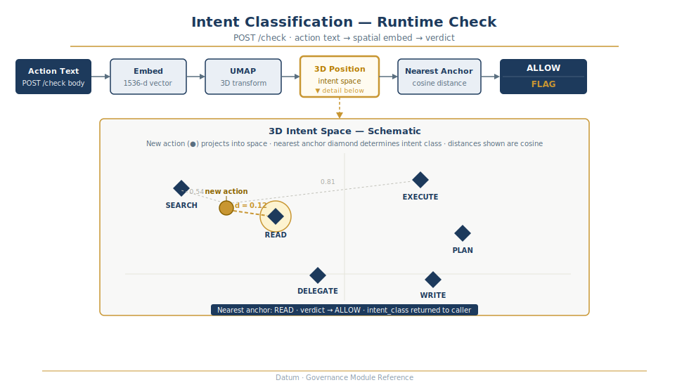

# Intent CRS — Training & Runtime Pipeline

How pre-labelling intent at training time eliminates the need for LLM calls at runtime.

## POST /check — single action flow

Text → embed → UMAP project → nearest anchor → `ALLOW` or `FLAG`. No LLM call at runtime.

---

## Training vs runtime

```mermaid
flowchart LR

  subgraph TRAIN["TRAINING — performed once, offline"]
    direction LR
    A["Agent Logs\ntool calls · actions"]
    B["High-Dim Embedding\nd = 1536"]
    C["Intent Labelling\nSEARCH · READ\nANALYZE · WRITE …"]
    D["Train UMAP\nlearns geometry"]
    E["Saved Model\n+ Anchors"]

    A -->|text → vector| B
    B -->|classify intent| C
    C -->|labelled training set| D
    D -->|persist| E
  end

  subgraph RUN["RUNTIME — per action, milliseconds"]
    direction LR
    F["New Agent\nAction"]
    G["Embed\nd = 1536"]
    H["Apply Saved\nUMAP  ·  d = 3"]
    I["Nearest Anchor\n→ Intent Label"]
    J["Spatial\nGovernance"]

    F -->|same model| G
    G -->|transform| H
    H -->|no LLM call| I
    I -->|loop · drift| J
  end

  E -.->|geometry loaded once at startup| H

  style A fill:#ffffff,stroke:#c4cdd6
  style B fill:#ffffff,stroke:#1d3a5c,color:#0f1923
  style C fill:#fdf6e8,stroke:#c89632,color:#0f1923,stroke-width:2px
  style D fill:#ffffff,stroke:#1d3a5c,color:#0f1923
  style E fill:#eef2f8,stroke:#1d3a5c,color:#0f1923

  style F fill:#ffffff,stroke:#c4cdd6
  style G fill:#ffffff,stroke:#1d3a5c,color:#0f1923
  style H fill:#eef2f8,stroke:#c89632,color:#0f1923,stroke-width:2px
  style I fill:#fdf6e8,stroke:#c89632,color:#0f1923,stroke-width:2px
  style J fill:#ffffff,stroke:#3a7a4a,color:#0f1923,stroke-width:2px

  style TRAIN fill:#eef2f8,stroke:#1d3a5c,stroke-width:2px,color:#1d3a5c
  style RUN fill:#fdf6e8,stroke:#c89632,stroke-width:2px,color:#c89632
```

## Why intent labelling at training time matters

At **training time**, each embedding gets tagged with an intent label (SEARCH, READ, ANALYZE, etc.). UMAP uses these labels as a supervision signal — it learns to pull same-intent embeddings together in 3D space and push different intents apart. The result is a **geometry that encodes intent**.

At **runtime**, there is no labelling step. A new action is embedded with the same model, then projected through the saved UMAP transform into the same 3D space. The nearest pre-computed anchor centroid determines intent. This is a distance lookup — no LLM, no classifier, no retraining.

| Stage | Cost | Frequency |
|---|---|---|
| Embed + label | LLM call per sample | Training only |
| Train UMAP | One-time compute | Training only |
| Save model + anchors | Disk write | Training only |
| Embed new action | ~50 ms | Every action |
| Apply UMAP transform | < 5 ms | Every action |
| Nearest-anchor lookup | < 1 ms | Every action |
